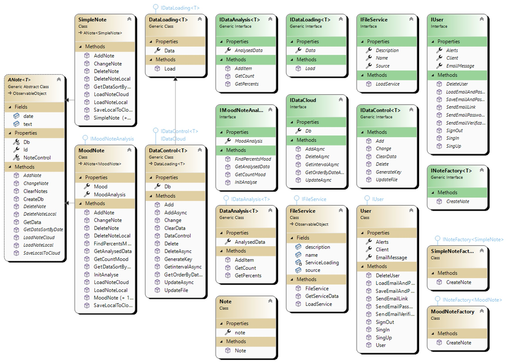

# OOP Coursework
Student: Klimkovich Nikolay Viktorovich

Group number: 153504

# MoodMate
This name means that the application will help users become a partner of their mood.

The app allows users to record their mood every day and analyze its changes over time, listen to soothing music and create notes.

# Security & Privacy
MoodMate is built on the principles of transparency and honesty. All data is stored locally on the device. No third parties have access to the data.

# Class Diagram
